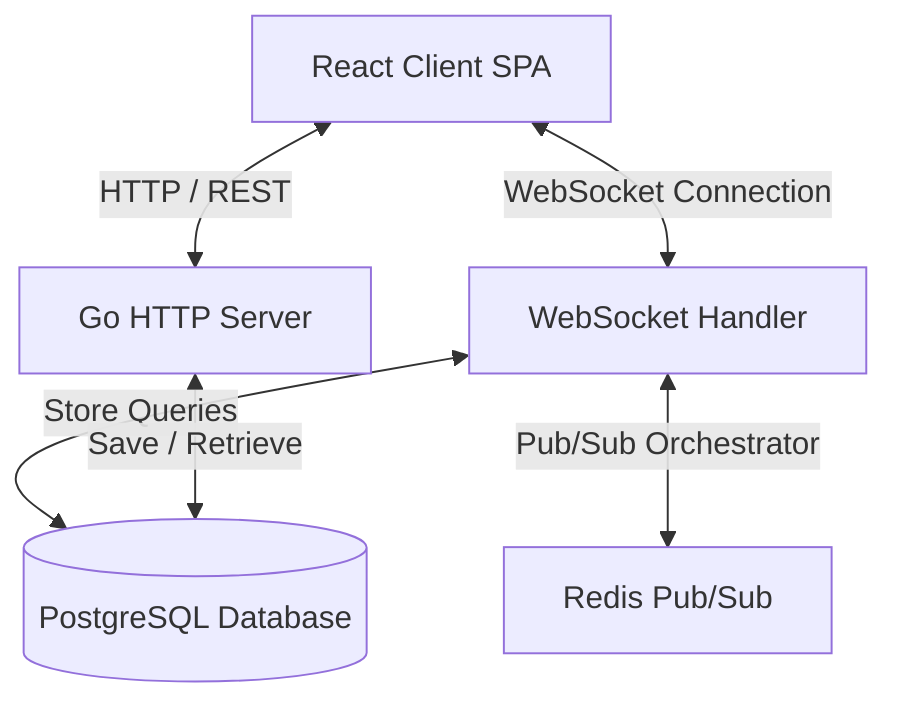
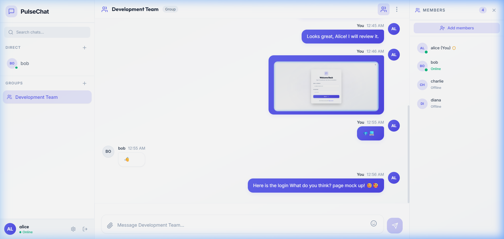
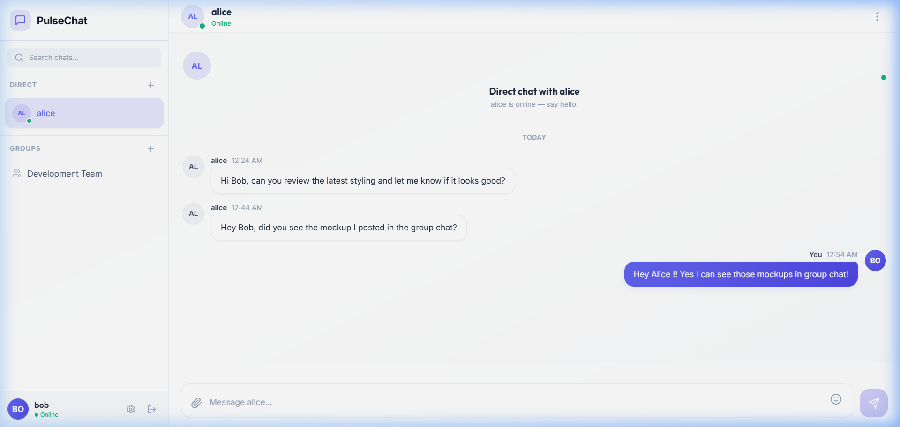
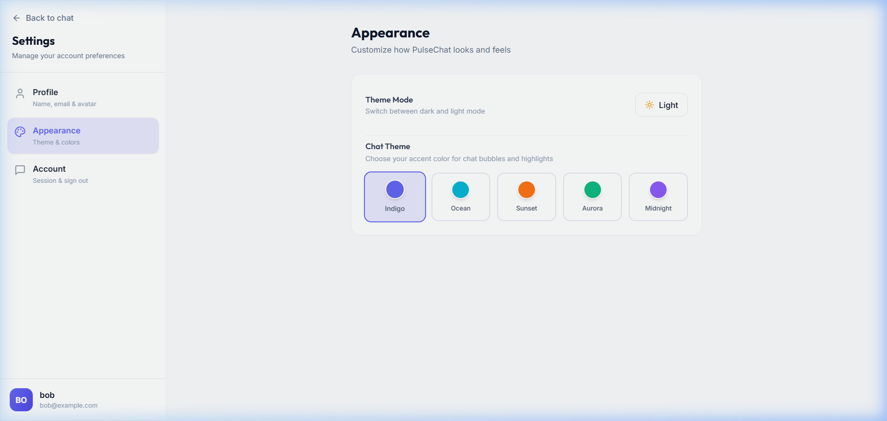

# PulseChat 💬

PulseChat is a high-performance, real-time chat application built using **Go (Golang)** on the backend and **React** with **TypeScript** on the frontend. The project showcases robust architectural choices, including clean Go domain separations, concurrent WebSocket read/write pumps, PostgreSQL persistent state, and Redis Pub/Sub scaling logic.

## Key Features

### Backend
- **Clean Architecture & Interfaces:** Decoupled handler, service, and store layers for testability and scaling.
- **WebSocket Connection Pump:** Independent, concurrent read/write goroutines handling connection lifecycles.
- **Online Presence & Typing Indicators:** Memory/Redis-backed presence managers showing who is online and typing.
- **Redis Pub/Sub Layer:** Horizontal scalability enabling room communications across multiple backend nodes.
- **PostgreSQL Persistence:** Complete storage mapping for users, rooms, members, and historical messages.
- **JWT Auth & Password Hashing:** Secure signups and logins using bcrypt and JWT claims.
- **Token Bucket Rate Limiting:** Limits WebSocket client traffic to `10 messages per 10 seconds` protecting resources.
- **Graceful Shutdown:** Intercepts OS signals (`SIGINT`, `SIGTERM`) to clean up channels and database connections.

### Frontend
- **Vite + TS Single-Page App:** Extremely fast hot-reloads and strict type-safety compilation.
- **Tailwind CSS Styling:** A dark-themed, sleek dashboard interface leveraging typography and gradients.
- **Native WebSocket Integration:** Automatic reconnection state machines inside custom hooks.
- **Protected Routing:** Prevents unauthenticated users from seeing active channels.
- **State Synchronizations:** Dynamic user list, message timeline, typing states, and badge connections.

---

## Directory Structure

```text
pulsechat/
├── backend/                  # Go HTTP API & WebSocket Server
│   ├── cmd/server/           # Application Entrypoint
│   ├── internal/             # Config, Handlers, Middleware, Models, Stores
│   ├── Dockerfile
│   └── .env.example
├── frontend/                 # React, TS & Tailwind Single-Page App
│   ├── src/                  # Components, Pages, Hooks, Services
│   ├── Dockerfile
│   ├── nginx.conf
│   └── .env.example
├── docker-compose.yml        # Orchestration script (Postgres, Redis, App)
└── README.md                 # Documentation
```

---

## Technical Architecture



---

## Getting Started

### Prerequisites
- [Docker & Docker Compose](https://www.docker.com/products/docker-desktop/)
- [Go 1.22+](https://go.dev/dl/)
- [Node.js v20+](https://nodejs.org/)

---

### Local Installation (Without Docker)

#### 1. Setup Database and Cache
Run local instances of PostgreSQL and Redis on default ports (`5432` and `6379`).

#### 2. Run Backend
```bash
cd backend
cp .env.example .env
go run cmd/server/main.go
```
The server will boot up, automatically run database migrations, and bind to `http://localhost:8080`.

#### 3. Run Frontend
```bash
cd frontend
cp .env.example .env
npm install
npm run dev
```
Open `http://localhost:5173` in your browser.

---

### Run using Docker Compose

To spin up the entire cluster (PostgreSQL, Redis, Go Backend, and Nginx React Frontend):

```bash
docker compose up --build
```
- Frontend: `http://localhost:3000`
- Backend API: `http://localhost:8080`

---

## Screenshots

### Interactive Group Chat & Presence


### Two-User Direct Messaging


### Appearance & Theme Customization

